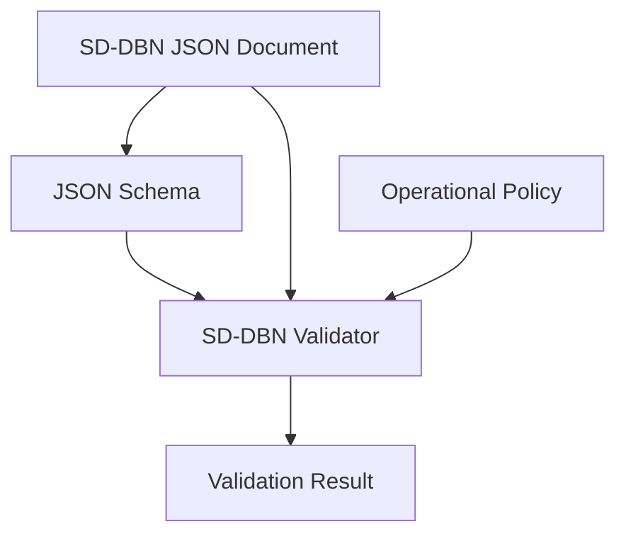

# SD-DBN フォーマット仕様 v3.0
## Situated Dynamic Bayesian Network — 状況づき動的ベイジアンネットワーク

---

## 1. はじめに

### 1.1 目的と適用範囲
本書は SD-DBN の**データフォーマットを定義する規範文書**である。データの構造(型・フィールド・
制約・適合性条件)を規定する。SD-DBN は**ドメインに依存しない汎用フォーマット**であり、営業・投資・
人事・診断など、状況に条件づけられた信念が情報の追加で変化する任意の領域に適用できる。
特定ドメインの語彙(課題・解決策・障壁など)は本書では定義せず、利用側がレイヤー語彙を
普遍オントロジー(§5.3)に対応づけて用いる。

### 1.2 概要
SD-DBN は、ある主体についての確率的な信念が、情報の追加に伴って時系列で変化する過程を表現する。
前提となる**状況**に条件づけられた**隠れた変数**の信念が、**観測**でどう動いたかを、追記のみの
ログとして記録する。データは2部からなる: 不変の定義部 `schema` と、追記される `events`。
変数(命題)だけでなく**推論(変数間の繋ぎ方)も第一級の対象**であり、ある推論が支持・反論・
言及されたことを記録できる。

---

## 2. 記法の規約

- 要求語 **MUST / MUST NOT / SHOULD / MAY** は適合性の強度を表す。MUST は違反すると不適合、
  SHOULD は推奨(逸脱には理由を要する)、MAY は任意。
- フィールド表の **必須**列: `○`=MUST、空欄=MAY、`○*`=条件付き必須(注記で条件を示す)。
- JSON 例の `<...>` は**プレースホルダ**であり、実際の値で置換する。
- **enum** と記した型は、定義された値集合のいずれか1つを取る。
- 型名 `instant` / `interval` / `duration` は §4 で定義する基底型を指す。

---

## 3. 用語

| 用語 | 定義 |
|---|---|
| **append-only** | 追記のみで記録する方式。既存の記録を書き換えず、変化を新しいイベントとして追加する。現在の状態は追記列を時刻順にたどって得る。 |
| **schema** | 不変の定義部。どんな変数が存在し、どう繋がりうるかの型。値や信念を持たない(§5)。 |
| **events** | 追記される時系列のログ部。各イベントは一度書かれたら不変(§6)。 |
| **variable** | 変数。確率変数の定義。`situation` / `latent` / `observation` の3種(§5.1)。 |
| **relation** | 関係、またはエッジ。変数間の依存。確率依存の型 `type` と普遍的意味 `scheme` を持つ(§5.2)。 |
| **role** | 役割。latent が論証で果たす普遍的役割。値は `state` / `goal` / `means` / `obstacle` / `factor`(§5.3)。 |
| **scheme** | 論証スキーム。エッジの普遍的な意味。値は `CAUSES` / `RESOLVES` / `CONFLICTS` など(§5.3)。 |
| **subrelation** | scheme をドメイン語彙で具体化した任意ラベル。利用側が定める(§5.2)。 |
| **latent** | 潜在変数。直接観測できない隠れた変数。確率分布で語る。 |
| **situation** | 状況。前提となる環境・条件。推定対象でなく、他変数の事前を左右する。 |
| **observation** | 観測。実際に観測された事象。潜在変数を推定する証拠。 |
| **posterior** | 事後分布。ある時点で定まった潜在変数の信念。`believed` が持つ。 |
| **perspective** | 観点。到達状態判定の基準となる文脈(§6.5)。被評価対象とそれ以外を区別する。利用側が具体的役割を割り当てる。 |
| **evidence_state** | 到達状態。イベント化された変数または論じられた推論の到達の質。値は `agreed` / `mentioned` / `rejected`(§6.5)。 |
| **argued** | ある推論(relation)が論じられ支持・反論・言及されたことを記録するイベント。推論を第一級にする(§6.2)。 |
| **attack_type** | 否定の論理的種類。`rebut` は結論否定、`undercut` は推論否定、`undermine` は前提否定を表す(§6.2.1)。 |
| **consensus** | 複数判定者の独立判定と多数決の記録(§6.4)。 |
| **carryover** | 別の時間軸からの事前の引き継ぎ(§6.6)。 |

---

## 4. 基底型: 時間 (time)

events と schema が参照する基底型。**時点は性質の異なる3種を区別する**(混同が誤りを生むため)。

### 4.1 時点 (instant)
次の3形式のいずれか1つを取る。

(a) **絶対時刻 `abs`** — 世界の時間軸上の点。主体・メディアを越えて比較・差分できる唯一の表現。
```json
{"abs": "2026-05-20T14:30:00"}
```
(b) **実経過の相対時点 `rel`** — 基準イベントの実時刻からの実世界の経過。
```json
{"rel": {"base": "<イベントID>", "elapsed": "PT12M30S"}}
```
(c) **メディアオフセット `media`** — 録画/録音の先頭からの**再生位置**。**実時刻ではない**。
そのメディア内でしか意味を持たず、別メディアの同じ値と比較できない。
```json
{"media": {"source": "<メディアID>", "offset": "00:12:30"}}
```

transcript/字幕の `00:12:30` は通常 `media`(再生位置)であって実時刻でも実経過でもない。
実装は media を実時刻として扱っては **MUST NOT**。比較・差分は abs に変換できる場合のみ行う。

### 4.2 メディア原点 (media_origin)
メディアオフセットを実時刻に対応づけたい場合に**のみ**用いる、メディア先頭の実時刻。
```json
{"source": "<メディアID>", "started_at": {"abs": "2026-05-20T14:00:00"}}
```
これがある場合に限り `started_at + offset` で `media.offset` を実時刻へ変換 **MAY**。なければ変換しない。

### 4.3 期間 (interval) / 経過 (duration)
```json
{"from": <instant>, "to": <instant>|null}   // interval: to=null で継続/未定
{"value": "P3M"}                              // duration: ISO 8601。media.offset の差分は不可(abs変換要)
```

### 4.4 2軸の時間 (補足)
やり取り**間**(A → 3ヶ月後のB)は各 `abs` で測る。やり取り**内**の発話の前後は `media.offset` の
大小で順序がわかる。内部発話を実時刻に乗せるときだけ media_origin を与え abs に変換する。

---

## 5. schema (定義部)

「何が存在し、どう繋がりうるか」の型定義。値や信念を持たない。一度定めたら書き換えては MUST NOT。
この不変性は **1つの SD-DBN 文書リビジョン内**での制約である。運用中に新しい変数や関係を追加する必要が
生じた場合は、既存 events を書き換えず、新しい schema を持つ後続リビジョン文書を作る。

```json
"schema": { "variables": [ <variable>, ... ], "relations": [ <relation>, ... ] }
```

### 5.1 variable (変数)

| フィールド | 必須 | 型 | 意味 |
|---|---|---|---|
| `id` | ○ | string | 一意な識別子 |
| `kind` | ○ | enum | `situation` / `latent` / `observation`(§5.1.1) |
| `domain` | ○ | array | 取りうる値の配列(§5.1.2) |
| `role` | ○* | enum | latent の普遍的役割(§5.3.1)。*kind=latent のとき必須 |
| `text` | | string | 人間可読の説明 |
| `subkind` | | string | role をドメイン語彙で具体化した任意ラベル(利用側が定める。例 営業 `need`) |
| `desired_values` | | array | この変数で望ましい値の集合。RESOLVES 等の direction 検証に使う |
| `undesired_values` | | array | この変数で望ましくない値の集合。解消すべき状態の present など |
| `frame` | | object | role に付随する構造。例 `{"as_is": "...", "to_be": "..."}`(state の現状/目標) |
| `ext_ref` | | any | 外部システムとの対応IDを保持する自由な場 |

#### 5.1.1 kind (3種)
| kind | 意味 | 関係での役割 |
|---|---|---|
| `situation` | 前提となる環境・条件。推定対象でなく他変数の事前を左右する。 | conditioning の起点 |
| `latent` | 直接観測できない隠れた変数。確率分布で語る。 | inference 等の主役 |
| `observation` | 実際に観測された事象。潜在変数を推定する証拠。 | emission の終点 |

#### 5.1.2 domain (標準値)
`domain` は kind に応じた値集合を取る。標準は次(利用側が拡張して MAY)。
| kind | 標準 domain |
|---|---|
| `situation` | `["false", "true"]` |
| `latent` | `["absent", "present"]`、または役割に応じた2値(例 `["unfit", "fit"]`) |
| `observation` | `["unobserved", "observed"]` |

### 5.2 relation (関係・エッジ)

変数間の依存。**エッジは2層の意味を持つ**: 確率依存の型 `type` と、普遍的な論証の意味 `scheme`。
`scheme` は普遍オントロジー(§5.3.2)であり、ドメイン非依存。`subrelation` は scheme を
ドメイン語彙で具体化した任意ラベルで、利用側が定める(MAY)。

| フィールド | 必須 | 型 | 意味 |
|---|---|---|---|
| `id` | ○ | string | relation の一意な識別子。events は原則としてこの id で relation を参照する |
| `type` | ○ | enum | 確率依存の大分類(§5.2.1) |
| `scheme` | ○ | enum | 普遍的な論証の意味(§5.3.2) |
| `from` | ○ | string | 起点変数の id |
| `to` | ○ | string | 終点変数の id |
| `subrelation` | | string | scheme のドメイン具体化ラベル(利用側が定める。例 営業 `solves`) |
| `cpd` | | object | 依存の強さ(§5.2.2) |
| `rationale` | | string | この依存を置く理由 |

#### 5.2.1 type (6種) と端点制約
| type | from の kind | to の kind | 意味 |
|---|---|---|---|
| `situational` | situation | situation | 前提環境の内部構造 |
| `conditioning` | situation | latent | 状況が潜在変数の事前を左右する |
| `inference` | latent | latent | 親の成立が子の成立確率を左右する(向きは cpd.direction。support は increase、解消は decrease) |
| `conflict` | latent | latent | 一方が成り立つと他方が成り立ちにくい(排他) |
| `preference` | latent | latent | 値の間の選好順序 |
| `emission` | latent | observation | 隠れた変数から観測への尤度 |

#### 5.2.2 cpd (依存の強さ)
次のいずれかの形式を取る。v3.0 の `cpd` は単一 relation の局所依存だけを表す。多親の完全な CPD は
本仕様の範囲外であり、必要な場合は複合変数として定義するか、利用側の推論エンジンで扱う。
- **数表**: `{"<親値>→<子値>": <確率 0–1>, ...}`(例 `{"present→observed": 0.9}`)
  - 数表は疎な尤度表として MAY。完全 CPD として扱う場合、同じ親値に対する子値の確率和は 1 でなければならない。
  - 欠損している組み合わせを 0 とみなしては MUST NOT。補完規則は利用側が明示する。
- **定性**: `{"direction": <enum>, "strength": <enum>}`
  - `direction` ∈ `increase` / `decrease`(親の成立が子の成立を上げる/下げる)
  - `strength` ∈ `weak` / `moderate` / `strong`

---

### 5.3 普遍オントロジー

役割(role)と論証スキーム(scheme)は**ドメインに依存しない普遍的な型**である。
営業の「課題/解決策」も医療の「症状/治療」も、これらの普遍型のドメイン具体化にすぎない。
利用側は自分のレイヤー語彙(subkind / subrelation)を、この普遍型に対応づける。

#### 5.3.1 role — latent の普遍的役割
| role | 定義 | ドメイン具体化の例(営業 / 投資 / 人事) |
|---|---|---|
| `state` | 成り立つ/解消されるべき状態 | 課題 / リスク / 組織課題 |
| `goal` | 主体が達成を望む状態 | 優先事項 / リターン目標 / 人材目標 |
| `means` | 状態を変える働きかけ・手段 | 解決策 / 投資戦略 / 施策 |
| `obstacle` | 目標や手段を妨げる状態 | 障壁 / 制約 / 抵抗 |
| `factor` | 他を構成・説明する要因 | 失敗要因 / リスク要因 / 離職要因 |

(means を実現する具体物・主体は、kind や frame で補足してよい。)

#### 5.3.2 scheme — 普遍的な論証関係
各 relation は `type`(確率依存)に加え `scheme`(普遍的意味)を持つ。
`allowed_types` は conformance で検証する許可集合である。
| scheme | 定義 (X→Y) | allowed_types | 具体化ラベル例 |
|---|---|---|---|
| `CAUSES` | X が Y を引き起こす | inference / conditioning | causes, triggers |
| `COMPOSES` | X が Y を構成する要因である | inference | has_factor |
| `RESOLVES` | 手段 X が状態・目標 Y を解消・達成する。Y が課題(解消すべき状態)なら X の成立は Y の成立確率を**下げる**(cpd.direction=decrease 必須)。Y が目標(達成したい状態)なら**上げる**(increase) | inference | solves, handles, overcomes |
| `REALIZES` | 抽象 X が具体 Y として実現される | inference | realized_by |
| `MANIFESTS_AS` | 潜在変数 X が観測 Y として現れる | emission | manifests_as, observed_as |
| `EXPLAINS` | X が Y の理由・説明になる | inference / conditioning | explains |
| `CONFLICTS` | X が Y と両立しない・Y を妨げる | conflict | triggers_objection |
| `PREFERS` | X が Y より選好される | preference | has_priority |
| `MOTIVATES` | X が Y を動機づける | inference / conditioning | motivates |
| `CONDITIONS` | 前提 X が Y の成立可能性を左右する | conditioning | (状況→課題の条件づけ) |
| `HAS_PROPERTY` | X が属性 Y を持つ | situational | has_characteristic |
| `PERFORMS` | 主体 X が行為 Y を行う | situational | performs |

利用側は `subrelation` で scheme を具体化して MAY(例 営業 `solves` → `scheme: RESOLVES`)。
`subrelation` 無しでも `scheme` だけで論証の意味は定まる。

**scheme と相関の向き**: `inference` は親の成立が子の成立確率を上げる(support)とは限らない。
向きは `cpd.direction` が表す。特に `RESOLVES` で Y の成立値が `undesired_values` に含まれる場合、
手段 X の成立は Y の成立確率を**下げる**ため `cpd.direction=decrease` を伴う(必須)。
Y の成立値が `desired_values` に含まれる場合は `cpd.direction=increase` を伴う。
「手段が課題を解消する」を「手段が課題の成立を増やす」と取り違えないため、RESOLVES では direction と
Y の `desired_values` / `undesired_values` を明示する。`relation.from`/`relation.to` の向き(どちらが親か)は `type` の確率依存方向に従い、
`MANIFESTS_AS` は `latent -> observation`(観測が仮説を支持する読みは逆向きの解釈)。

---

## 6. events (ログ部)

時刻順に追記されるイベントの配列。各イベントは一度書かれたら不変(書き換え MUST NOT)。

### 6.1 共通フィールド
| フィールド | 必須 | 型 | 意味 |
|---|---|---|---|
| `id` | ○ | string | イベントの一意な識別子 |
| `seq` | ○ | int | 追記順を表す単調増加の整数 |
| `time` | ○ | instant | このイベントの時点(§4.1) |
| `type` | ○ | enum | イベント種別 `observed`/`situated`/`believed`/`transition`/`argued`(§6.2) |
| `variable` | ○* | string | 対象変数の id。*`argued` 以外で必須(種別が要求する kind に一致) |
| `relation_id` | ○* | string | 対象の推論。*`argued` で必須。schema の relation `id` を指す |
| `caused_by` | | string | このイベントを引き起こした入力の識別(情報の出所) |
| `rationale` | | string | なぜこのイベントが記録されたか |
| `by_perspective` | | object | どの観点に由来するか(例 `{"<観点>": 1}`)。到達状態判定の根拠(§6.5) |
| `evidence_state` | | enum | 到達の質(§6.5) |
| `attack_type` | | enum | `evidence_state`=rejected のときの否定の論理的種類(§6.2.1) |
| `consensus` | | object | 複数判定者の合意(§6.4) |
| `embedded` | | object | 細かい内部構造(任意) |

### 6.2 イベント種別

**`situated`** — 状況が定まった/変わった。
| 追加フィールド | 必須 | 意味 |
|---|---|---|
| `value` | ○ | situation 変数の値 |
| `valid` | | この状況が有効な期間(interval)。`to`=null で以降継続 |

**`observed`** — 観測が起きた。
| 追加フィールド | 必須 | 意味 |
|---|---|---|
| `value` | ○ | observation 変数の観測値 |
| `media_origin` | | このイベントが対応する録画の原点(§4.2) |

**`believed`** — ある潜在変数への信念が、ある時点で定まった。
| 追加フィールド | 必須 | 意味 |
|---|---|---|
| `posterior` | ○ | その時点の事後分布(例 `{"present":0.9,"absent":0.1}`) |
| `prior` | | その時点の事前分布 |
| `from_observation` | | この信念を導いた observed イベントの id |

**`transition`** — 観測なしの時間経過による潜在変数の変化。
| 追加フィールド | 必須 | 意味 |
|---|---|---|
| `to_value` | ○* | 遷移後の値(または分布)。*`elapsed` だけでは状態が定まらないため、`to_value` または `posterior` のいずれか必須 |
| `posterior` | ○* | 遷移後の事後分布。*`to_value` がない場合は必須 |
| `from_value` | | 遷移前の値(または分布) |
| `elapsed` | | どれだけの経過に伴うか(duration) |

**`argued`** — ある推論(relation)が論じられ、どう扱われたか。
**推論を第一級の対象とするためのイベント**。variable でなく relation を対象に取る。
schema が「ありうる推論」を定義し、`argued` が「その推論が実際に持ち出され、支持/反論/言及された」
ことを記録する。対象 relation の type は `inference`・`conflict`・`preference` のいずれでもよい
(推論・衝突・選好の3種の適用すべてを第一級の対象とする)。
| 追加フィールド | 必須 | 意味 |
|---|---|---|
| `relation_id` | ○ | 対象の推論。schema 実在の relation `id` を指す |
| `evidence_state` | ○ | 推論の到達の質(§6.5) |
| `attack_type` | ○* | 否定の論理的種類(§6.2.1)。*`evidence_state`=rejected のとき必須 |
| `from_observation` | | この argued を導いた observed イベントの id |

`argued` の `evidence_state` は**推論そのもの**の受け止められ方であり、両端ノードの `believed`/到達状態とは
独立(§6.5.1)。推論への反論は新しい `argued` を追記して表す(append-only)。
schema に定義のない推論は `argued` の対象にできない(C9, §7.2)。

#### 6.2.1 attack_type — 否定の論理的種類
否定は論理的に3種に区別される。`evidence_state`=rejected のとき `attack_type` で示す。
ノード(believed)・推論(argued)いずれの rejected にも付きうる。
| 値 | 否定の対象 | 意味 |
|---|---|---|
| `rebut` | 結論 | 結論そのものを否定する(「Y ではない」)。前提も推論も認めた上で帰結を退ける。 |
| `undercut` | 推論 | 前提から結論への**繋ぎ方**を否定する(「X でも X→Y は成り立たない」)。前提は認める。 |
| `undermine` | 前提 | **前提そのもの**を否定する(「そもそも X が偽」)。 |

3種は対応が異なるため区別する。例(RESOLVES 推論「手段 X は状態 Y を解消する」への否定):
- `undermine`: 「そもそも X という手段は適用できない」または「Y という状態はない」→ 前提の合意からやり直す。
- `undercut`: 「X はあるが Y には効かない」→ 前提は握れている。別の手段を当てる。
- `rebut`: 「X を行っても Y は解消しない(結果が出ない)」→ 手段の有効性の証拠が要る。

`undermine` は前提ノードの到達状態=rejected として、`undercut` は推論の `argued`=rejected として現れる。

### 6.3 信念の最新値
上書きは行わない。信念が再び動けば新しい `believed` を追記する。ある変数の現在の信念 =
最新(最大 seq)の `believed` の posterior。

### 6.4 consensus (複数判定者の合意)
ある変数/推論の判定を複数の判定者が独立に行い、多数決で決める運用のための場。
```json
"consensus": {
  "agreement": 1.0,
  "tally": {"record": 3, "discard": 0, "abstain": 0},
  "judgments": [ {"agent": "A01", "verdict": "record", "state": "agreed", "rationale": "..."} ]
}
```
| フィールド | 意味 |
|---|---|
| `agreement` | 合意度(0–1) = 非 abstain 判定者の中の最頻判定人数 / 非 abstain 判定者数。posterior 更新式は本仕様では定義しない |
| `tally` | 判定の内訳 |
| `judgments` | 各判定者の判定。`abstain` は多数決から除外する |

**verdict と evidence_state の関係**: judgment の `verdict` は2軸の1つめ — その対象を
**イベント化するか**の判定で `record`(記録する) / `discard`(記録しない) / `abstain`(保留)。
`state` は2つめ — 記録する場合の**質**(§6.5)。多数決の結果 `record` となった対象だけが events 化され、
その `evidence_state` は record 判定者の `state` の多数決で決まる。**注意**: `verdict=discard`(記録
しない)と `evidence_state=rejected`(否定として記録する)は別物。否定の論点も「記録する」対象であり、
`verdict=record` かつ `state=rejected` で表す。`discard` 多数・`abstain` 多数・多数決不能の対象は
events 化されず、保留として別途扱う(運用)。

### 6.5 evidence_state (到達状態) — 到達の質
イベント化された変数または推論が**どう受け止められたか**の質。posterior とは別に到達段階を表す。
到達状態は**観点(perspective)**に基づく — 評価の文脈は、被評価対象の観点と、それ以外の観点を区別する
(利用側が具体的役割を割り当てる。例 営業評価では被評価対象=売り手、相手=買い手)。
| 値 | 意味 |
|---|---|
| `agreed` | **被評価対象でない観点**が支持した。自ら表明した/明示同意した/障害が解消された。自発的表明は最も強いシグナル。 |
| `mentioned` | **一方の観点のみ**が提示し、他方が関与していない(言いっぱなし) |
| `rejected` | ある観点が否定・未解消の障害を表明した |

`none`(イベント化されない)場合はイベントを作らないため、`evidence_state` の値としては現れない。

#### 6.5.1 ノードの到達状態と推論の到達状態
到達状態は2つの対象に独立に付く。
- **ノード(variable)の到達状態** — その論点(命題)がどう受け止められたか。`believed` 等に付く。
- **推論(relation)の到達状態** — その推論(「A だから B」)がどう扱われたか。`argued` に付く(§6.2)。

両者は**独立**に決まる。例: 状態 A は支持され(ノード=agreed)、手段 B も提示された(ノード=mentioned)が、
「B は A を解消する(RESOLVES)」という推論には反論があった場合、その推論の `argued` は `rejected`。
ノードと推論の状態を別に持つことで、「どの論点が」でなく「どの**繋ぎ方**が」否定されたかを記録できる。

### 6.6 carryover (別時間軸からの事前)
別の時間軸から事前を引き継ぐ起点。events の最初の believed として表しても MAY。
```json
"carryover": {"from": "<別の時間軸の識別子>", "prior_beliefs": {"<変数id>": {"<値>": 確率}}}
```

---

## 7. ドキュメント構造と適合性

### 7.1 トップレベル構造
```json
{
  "@type": "SD-DBN",
  "version": "3.0",
  "id": "<この文書の一意な識別子>",
  "subject": "<対象主体の識別子>",
  "schema_revision": 1,
  "supersedes": "<前リビジョンの文書ID>|null",
  "schema": { "variables": [ ... ], "relations": [ ... ] },
  "events": [ ... ],
  "subject_meta":    { ... },
  "current_beliefs": { ... },
  "carryover":       { ... }
}
```
| フィールド | 必須 | 型 | 意味 |
|---|---|---|---|
| `@type` | ○ | string | 固定値 `"SD-DBN"` |
| `version` | ○ | string | フォーマットのバージョン |
| `id` | ○ | string | この文書の一意な識別子。`supersedes` から参照される |
| `subject` | ○ | string | 対象主体の識別子 |
| `schema_revision` | ○* | int | 同一 subject 内の schema リビジョン番号。*`supersedes` がある場合は必須。schema 拡張時に増加 |
| `supersedes` | | string/null | 前リビジョンの文書 `id`。初版または単独文書では null または省略 |
| `schema` | ○ | object | 不変の定義部(§5) |
| `events` | ○ | array | 追記のログ部、seq 昇順(§6) |
| `subject_meta` | | object | 主体の補助情報 |
| `current_beliefs` | | object | events から導ける現在の信念の投影(派生物・キャッシュ) |
| `carryover` | | object | 別の時間軸からの事前引き継ぎ(§6.6) |

### 7.2 適合性条件 (conformance)
妥当な SD-DBN ドキュメントは次をすべて満たす(MUST)。

- **C1 トップレベル**: `@type`="SD-DBN"、`version`、`id`、`subject`、`schema`、`events` が存在する。
  `supersedes` がある場合は `schema_revision` も持つ。
- **C2 変数**: 各 variable が `id`・`kind`・`domain` を持つ。`id` は schema 内で一意。
  kind=latent は `role`(§5.3.1)を持つ。`desired_values` / `undesired_values` を持つ場合、その値は
  `domain` に含まれ、同じ値が両方に現れてはならない。
- **C3 関係**: 各 relation が `id`・`type`・`scheme`・`from`・`to` を持つ。`id` は schema 内で一意。
  `scheme` は §5.3.2 で定義された値で、`type` はその `allowed_types` に含まれる。
  `from`/`to` が §5.2.1 の端点制約に
  適合する(`situation` は situational 両端と conditioning の from 以外の端点にならない。
  `observation` はどの relation の from にもならない。`emission` の to は observation)。
  `scheme=RESOLVES` では `cpd.direction` を持つ。`to` 変数の成立値が `undesired_values` に含まれる場合は
  `decrease`、`desired_values` に含まれる場合は `increase` に整合する。
- **C4 参照整合**: relation と event が参照する `variable` id は schema に実在する。
  `argued.relation_id` は schema に実在する relation `id` を指す。
- **C5 append-only**: events は seq 昇順。既存イベントの書き換え・削除がない。同一変数の信念変化は
  新しい `believed` の追記で表される(上書きでない)。
- **C6 イベント整合**: 各 event の `type` が要求する追加フィールドを持つ。`variable` を対象とする種別
  (`situated`/`observed`/`believed`/`transition`)では `variable` の kind が種別に整合する
  (`situated`→situation、`observed`→observation、`believed`/`transition`→latent)。
  `transition` は `to_value` または `posterior` のいずれかを持つ。
- **C7 時間**: `time` は §4.1 の instant 3形式のいずれか。`media` を実時刻として比較・差分しない。
- **C8 派生物**: `current_beliefs` を持つ場合、その内容は events から再計算した最新 believed と一致する。
- **C9 推論イベント**: `argued` は `relation_id` を持ち、それは schema 実在の relation を指す(C4)。
  対象 type は inference/conflict/preference のいずれか。`variable` は持たない。
  `evidence_state` を持ち、それが rejected のとき `attack_type` を持つ。

SHOULD: kind=latent の variable は relation で論証に接続される。relation は普遍的意味 `scheme` を持ち、
ドメイン語彙が必要なら `subrelation` で具体化する。

---

## 8. JSON Schema と実装要件

SD-DBN は、人間可読の仕様本文に加えて、機械検証用の JSON Schema を持つ。JSON Schema は
**静的なフォーマット検証**を担う。参照整合、確率分布の完全性、append-only 運用の遵守など、
単一 JSON Schema だけで十分に表せない条件は、validator 実装で追加検証する。



### 8.1 JSON Schema の位置づけ

| 層 | 責務 |
|---|---|
| JSON Schema | フィールドの存在、型、enum、oneOf、基本的な object/array 構造を検証する |
| Validator | schema 内 ID の一意性、relation/event の参照整合、posterior の domain 整合、確率和などを検証する |
| Operational policy | append-only、audit、保存時の競合制御、revision chain の運用を扱う |
| Inference engine | posterior 更新、欠損 CPD の補完、consensus から信念への反映を扱う |

JSON Schema は SD-DBN core の構造を定義する。ドメイン固有語彙は `subkind` / `subrelation` /
`perspective` / `text` / `frame` / `ext_ref` などの値として現れるだけであり、JSON Schema 自体を
ドメイン別に分岐させては SHOULD NOT。

### 8.2 推奨ファイル構成

JSON Schema と validator は、仕様本文と同じリポジトリで管理することを SHOULD。

```text
sd-dbn/
  spec/
    sd-dbn.md
  schemas/
    sd-dbn.schema.json
    defs/
      base.schema.json
      ontology.schema.json
      document.schema.json
      variable.schema.json
      relation.schema.json
      event.schema.json
      consensus.schema.json
  examples/
    valid/
      minimal.json
      complete.json
      revision.json
    invalid/
      missing-required-field.json
      unknown-variable-reference.json
      invalid-probability-distribution.json
      invalid-relation-endpoints.json
  tools/
    validate-sd-dbn.ts
  tests/
    schema.test.ts
    validator.test.ts
```

### 8.3 Schema draft と識別子

- JSON Schema は **Draft 2020-12** を使う。
- ルート schema は `$schema` と `$id` を持つ。
- `$id` はフォーマットバージョンを含む安定 URL とする。
- 破壊的変更を行う場合は `version` と `$id` の major/minor を更新する。

```json
{
  "$schema": "https://json-schema.org/draft/2020-12/schema",
  "$id": "https://sd-dbn.org/schemas/3.0/sd-dbn.schema.json",
  "title": "SD-DBN Document",
  "type": "object"
}
```

### 8.4 JSON Schema で検証する項目

JSON Schema は次を MUST 検証する。

| 対象 | 検証 |
|---|---|
| top-level | `@type`, `version`, `id`, `subject`, `schema`, `events` の存在と型 |
| time | `instant` が `abs` / `rel` / `media` のいずれか1形式だけを持つこと |
| variable | `id`, `kind`, `domain` の存在、`kind` の enum、`domain` が非空 array であること |
| relation | `id`, `type`, `scheme`, `from`, `to` の存在、`type` / `scheme` の enum |
| event | 共通フィールドの型、`type` ごとの必須フィールド、`argued` が `relation_id` を持つこと |
| probability | 数値が `0 <= p <= 1` の範囲にあること |
| consensus | `agreement`, `tally`, `judgments` の基本構造 |

### 8.5 Validator で追加検証する項目

JSON Schema だけで扱いにくい次の条件は validator が MUST 検証する。

| 条件 | 理由 |
|---|---|
| variable `id` の一意性 | JSON Schema 単体では配列内 object の特定 property 一意性を扱いにくい |
| relation `id` の一意性 | 同上 |
| event `id` と `seq` の一意性 | 同上 |
| events の `seq` 昇順 | フォーマット上の順序検証 |
| relation `from` / `to` が実在 variable を指すこと | schema 内参照の検証 |
| relation endpoint が `type` の端点制約に合うこと | 複数 object 間の意味検証 |
| event `variable` が実在 variable を指し、event `type` と kind が整合すること | 複数 object 間の意味検証 |
| `argued.relation_id` が実在 relation を指し、対象 type が inference/conflict/preference であること | 複数 object 間の意味検証 |
| `posterior` / `prior` の key が variable `domain` に含まれること | 対象 variable 依存の検証 |
| 完全分布として扱う `posterior` の確率和が 1 であること | JSON Schema の範囲外 |
| `current_beliefs` が events から再計算した最新 believed と一致すること | 派生物検証 |
| `RESOLVES` の `cpd.direction` が `desired_values` / `undesired_values` と整合すること | 意味検証 |

append-only は運用ポリシーであり、単一文書の静的 conformance では検証しない。
validator は、過去リビジョンや永続化ログを入力として受け取る場合に限り、削除・書き換えの有無を
policy check として検証して MAY。

### 8.6 Validator の出力

validator は machine-readable な結果を返すことを SHOULD。

```json
{
  "valid": false,
  "errors": [
    {
      "code": "UNKNOWN_VARIABLE_REFERENCE",
      "path": "/schema/relations/0/from",
      "message": "relation.from does not reference an existing variable id"
    }
  ],
  "warnings": []
}
```

エラーには少なくとも `code`, `path`, `message` を含める。`path` は JSON Pointer とする。
複数エラーを検出できる場合、最初の1件で停止せず、可能な範囲で列挙することを SHOULD。

### 8.7 必要な実装

SD-DBN を実運用する実装は、少なくとも次を持つことを SHOULD。

| 実装 | 内容 |
|---|---|
| JSON Schema bundle | `schemas/sd-dbn.schema.json` と `schemas/defs/*.schema.json` |
| Validator library | JSON Schema 検証と §8.5 の追加検証を行う library |
| CLI validator | `sd-dbn validate <file>` 相当のコマンド |
| Test fixtures | valid / invalid example を使った regression tests |
| Versioned schemas | `3.0` などの format version ごとの schema 固定 |
| Derived view checker | `current_beliefs` など派生物の再計算チェック |

validator は次の順序で処理することを SHOULD。

1. JSON として parse する。
2. JSON Schema で構造検証する。
3. schema 内の variable / relation / event index を構築する。
4. 参照整合と端点制約を検証する。
5. distribution / cpd / evidence_state / current_beliefs の意味検証を行う。
6. policy input がある場合のみ append-only などの運用ポリシーを検証する。

---

## 9. 完全な例

ドメイン非依存の普遍型(role / scheme)に、営業ドメインの具体化(subkind / subrelation /
perspective)を付した例。

```json
{
  "@type": "SD-DBN", "version": "3.0", "id": "doc-example-001-r1", "subject": "example-001",
  "schema": {
    "variables": [
      {"id": "S_newgrad", "kind": "situation", "domain": ["false","true"],
       "text": "新人を大量に一斉受け入れている状況"},
      {"id": "X_dev", "kind": "latent", "role": "state", "subkind": "need",
       "domain": ["absent","present"],
       "desired_values": ["absent"], "undesired_values": ["present"],
       "frame": {"as_is": "育成の良し悪しを判断できない", "to_be": "データで判断できる"},
       "text": "育成判断ができないという状態"},
      {"id": "X_kpi", "kind": "latent", "role": "means", "subkind": "solution_fit",
       "domain": ["unfit","fit"], "desired_values": ["fit"], "undesired_values": ["unfit"],
       "text": "行動指標の設計という手段"},
      {"id": "O_dev", "kind": "observation", "domain": ["unobserved","observed"],
       "text": "『判断できない』という当事者の言明"}
    ],
    "relations": [
      {"id": "r1", "type": "conditioning", "scheme": "CONDITIONS", "from": "S_newgrad", "to": "X_dev",
       "cpd": {"direction": "increase", "strength": "strong"},
       "rationale": "新人大量受け入れが育成判断課題の事前を上げる"},
      {"id": "r2", "type": "inference", "scheme": "RESOLVES", "subrelation": "solves",
       "from": "X_kpi", "to": "X_dev",
       "cpd": {"direction": "decrease", "strength": "moderate"},
       "rationale": "行動指標設計の手段(fit)は育成判断ができない状態(present)の成立確率を下げる(解消)"},
      {"id": "r3", "type": "emission", "scheme": "MANIFESTS_AS", "subrelation": "observed_as",
       "from": "X_dev", "to": "O_dev",
       "cpd": {"present→observed": 0.9, "absent→observed": 0.1}}
    ]
  },
  "events": [
    {"id": "e1", "seq": 1, "time": {"abs": "2026-05-18T00:00:00"},
     "type": "situated", "variable": "S_newgrad", "value": "true",
     "valid": {"from": {"abs": "2026-05-18T00:00:00"}, "to": null},
     "evidence_state": "agreed", "by_perspective": {"customer": 1},
     "caused_by": "background_info:report", "rationale": "背景情報で確認"},

    {"id": "e2", "seq": 2, "time": {"media": {"source": "rec-1", "offset": "00:12:30"}},
     "type": "observed", "variable": "O_dev", "value": "observed",
     "media_origin": {"source": "rec-1", "started_at": {"abs": "2026-05-20T14:00:00"}},
     "by_perspective": {"customer": 1}, "caused_by": "transcript:meeting-1",
     "rationale": "再生位置12:30の当事者の明示的言明。実時刻は14:12:30"},

    {"id": "e3", "seq": 3, "time": {"media": {"source": "rec-1", "offset": "00:12:30"}},
     "type": "believed", "variable": "X_dev",
     "prior": {"present": 0.55}, "posterior": {"present": 0.9, "absent": 0.1},
     "from_observation": "e2", "evidence_state": "agreed", "by_perspective": {"customer": 1},
     "consensus": {"agreement": 1.0, "tally": {"record": 3, "discard": 0, "abstain": 0},
       "judgments": [
         {"agent": "A01", "verdict": "record", "state": "agreed"},
         {"agent": "A02", "verdict": "record", "state": "agreed"},
         {"agent": "A03", "verdict": "record", "state": "agreed"}]},
     "rationale": "当事者が自ら明示的に状態を述べた。3名一致で agreed"},

    {"id": "e4", "seq": 4, "time": {"media": {"source": "rec-1", "offset": "00:31:05"}},
     "type": "believed", "variable": "X_kpi",
     "posterior": {"fit": 0.55, "unfit": 0.45}, "evidence_state": "mentioned",
     "by_perspective": {"vendor": 1}, "rationale": "一方の観点のみが手段を提示"},

    {"id": "e5", "seq": 5, "time": {"media": {"source": "rec-1", "offset": "00:31:40"}},
     "type": "argued",
     "relation_id": "r2",
     "evidence_state": "rejected", "attack_type": "undercut",
     "by_perspective": {"vendor": 1, "customer": 1},
     "rationale": "『手段 X_kpi は状態 X_dev を解消する』と論じられたが、相手が『生存者バイアスがあり指標だけでは判断できない』と推論自体に反論。前提(状態 agreed)も手段(mentioned)も生きているが、両者を繋ぐ RESOLVES 推論は否定された(undercut)"}
  ]
}
```

現在の信念は events を seq 順にたどり、各変数の最新 `believed` の posterior を読む
(例では X_dev = e3 の `{"present":0.9}`)。推論の状態は `argued` が持つ(例では RESOLVES が e5 で
rejected/undercut)。ノードの状態とは独立に、「両者を繋ぐ推論が否定された」ことが記録される。
